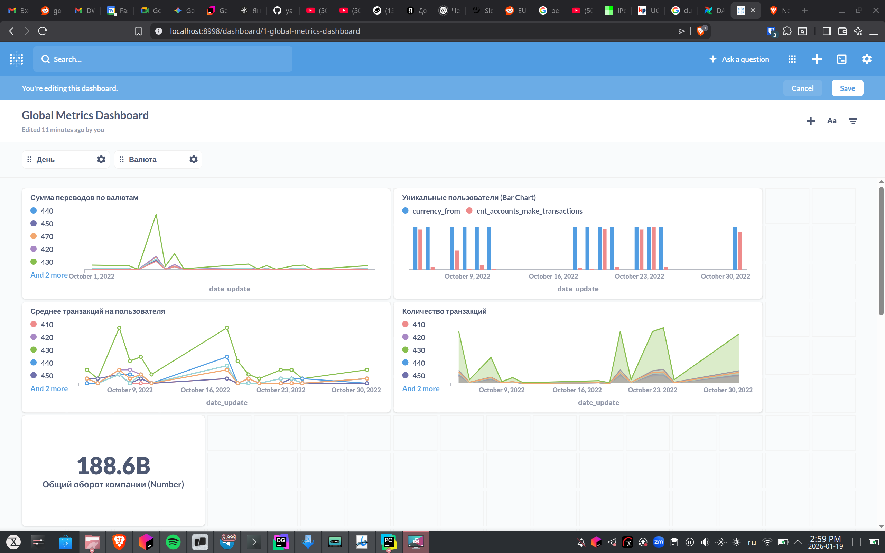

# Дашборд Global Metrics

Визуализация агрегированных метрик транзакций из витрины `VT251126648744__DWH.global_metrics`.



## Исключённые данные

Дата **2022-10-01** исключена из всех визуализаций.

**Причина:** аномальные данные — все ~17 000 транзакций были совершены только 2 уникальными аккаунтами, что даёт нереалистичное значение `avg_transactions_per_account` ≈ 8 000 вместо нормального ≈ 1.

| Дата       | Транзакций | Уникальных аккаунтов | Среднее на аккаунт |
|:-----------|:-----------|:---------------------|:-------------------|
| 2022-10-01 | 17 708     | 2                    | 8 854              |
| 2022-10-05 | 17 917     | 17 389               | 1.03               |

Вероятная причина: тестовые или системные операции в первый день работы системы.

---

## SQL-запросы для визуализаций

### Сумма переводов по валютам

```sql
SELECT
    date_update,
    currency_from,
    amount_total
FROM VT251126648744__DWH.global_metrics
WHERE date_update > '2022-10-01'
  AND {{date_filter}}
  AND {{currency_filter}}
ORDER BY date_update
```

### Среднее транзакций на пользователя

```sql
SELECT
    date_update,
    currency_from,
    avg_transactions_per_account
FROM VT251126648744__DWH.global_metrics
WHERE date_update > '2022-10-01'
  AND {{date_filter}}
  AND {{currency_filter}}
ORDER BY date_update
```

### Уникальные пользователи

```sql
SELECT
    date_update,
    currency_from,
    cnt_accounts_make_transactions
FROM VT251126648744__DWH.global_metrics
WHERE date_update > '2022-10-01'
  AND {{date_filter}}
  AND {{currency_filter}}
ORDER BY date_update
```

### Общий оборот компании

```sql
SELECT
    SUM(amount_total) AS total_turnover
FROM VT251126648744__DWH.global_metrics
WHERE date_update > '2022-10-01'
  AND {{date_filter}}
  AND {{currency_filter}}
```

### Количество транзакций

```sql
SELECT
    date_update,
    currency_from,
    cnt_transactions
FROM VT251126648744__DWH.global_metrics
WHERE date_update > '2022-10-01'
  AND {{date_filter}}
  AND {{currency_filter}}
ORDER BY date_update
```

---

## Переменные Metabase

- `{{date_filter}}` — Field Filter → `date_update`
- `{{currency_filter}}` — Field Filter → `currency_from`
