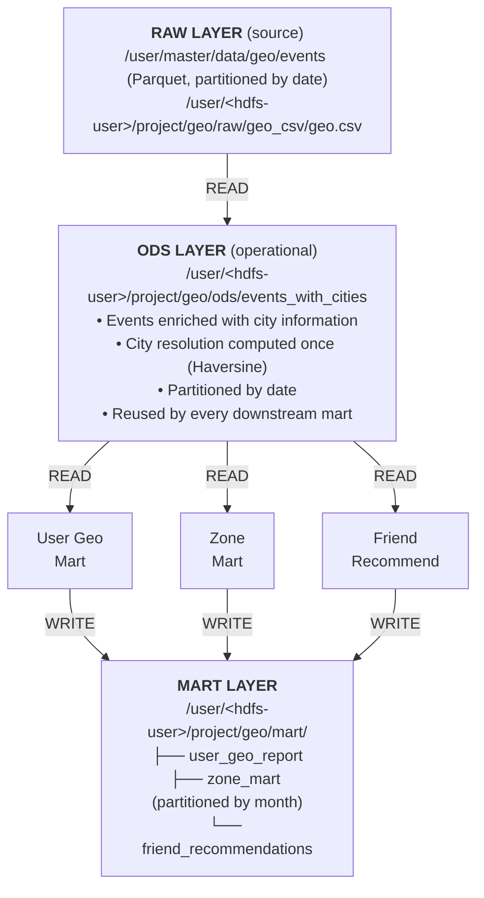

# Sprint 7 Project: Geo Recommendations Data Lake

## Overview

A production-grade Data Lake solution that delivers geo-aware recommendations for users of a social network serving the Australian region. The project covers location tracking, per-city event analytics, and friend recommendations, implemented on Apache Spark, HDFS, and Apache Airflow.

## Project Layout

```
sprint-7-geo-recommendations/
├── dags/
│   ├── geo_marts_dag.py          # Airflow orchestration
│   ├── validate_dag.py           # DAG validation
│   └── DEPLOYMENT.md             # Deployment guide
│
├── src/scripts/
│   ├── create_schema.py          # Creates the HDFS directory layout
│   ├── geo_utils.py              # Utilities: Haversine distance, city resolution
│   ├── create_ods_layer.py       # Builds the ODS layer
│   ├── user_geo_mart.py          # User geo analytics mart
│   ├── zone_mart.py              # Per-city event aggregation mart
│   └── friend_recommendations.py # Friend recommendation mart
│
├── geo.csv                       # City dictionary (24 Australian cities)
├── .gitignore                    # Git ignore patterns
└── README.md                     # This file
```

**Totals:** 6 production Python scripts plus one Airflow DAG and utilities.

## Data Lake Architecture

### Three-layer architecture



### Benefits of the ODS layer

**Without ODS:**
- Every mart independently loads the full event stream from RAW.
- `find_nearest_city()` (cross-join N × 24) runs three times.
- User-location extraction is duplicated.
- Haversine-based city resolution is computed redundantly.

**With the ODS layer:**
1. **Performance:** roughly 3× speed-up (expensive operations happen once).
2. **Reuse:** the enriched data serves every mart.
3. **Data quality:** validation and checks are centralized.
4. **Fast iteration:** marts can be rebuilt from ODS without rereading RAW.
5. **Debugging:** easier to isolate problems at each pipeline stage.

## Implemented Optimizations

### 1. Broadcast join for the city dictionary ✅

**File:** `geo_utils.py:114`

```python
# OPTIMIZATION: broadcast the small city table (24 rows).
events_with_cities = events_df.crossJoin(F.broadcast(cities_renamed))
```

**Effect:** accelerates the cross-join by replicating the small table on all executors.

### 2. ODS layer for reuse ✅

**File:** `create_ods_layer.py`

```python
events_with_cities.write \
    .mode("overwrite") \
    .partitionBy("date") \
    .parquet(output_path)
```

**Effect:**
- City resolution is performed once instead of three times.
- Marts read ready-made enriched data.
- Overall pipeline speed-up of 2–3×.

### 3. Adaptive query execution ✅

All scripts set:

```python
spark.sql.adaptive.enabled = true
```

**Effect:** dynamic plan optimization based on runtime statistics.

### 4. Shuffle partition tuning ✅

```python
spark.sql.shuffle.partitions = 20  # For the 1.5 GB dataset
```

**Effect:** balances parallelism and overhead.

### 5. Date partitioning ✅

**ODS layer:**
```python
.partitionBy("date")
```

**Zone mart:**
```python
.partitionBy("month")
```

**Effect:** efficient partition pruning for time-based queries.

## Data Marts

### 1. User Geo Analytics Mart

- **Script:** `user_geo_mart.py`
- **Output:** `/user/student/project/geo/mart/user_geo_report`

**Schema:**

| Field | Type | Description |
|-------|------|-------------|
| user_id | long | User identifier |
| act_city | string | Most active city (last 30 days) |
| home_city | string | Home city (27+ consecutive days of presence) |
| travel_count | long | Number of city changes |
| travel_array | array<string> | Ordered list of visited cities |
| local_time | timestamp | Time of the last event in the local time zone |

**Key algorithms:**
- Haversine formula for city resolution.
- Window function for the most recent activity.
- Home-city detection based on streaks of 27+ consecutive days.
- `lag` window function for travel tracking.

### 2. Zone (City) Mart

- **Script:** `zone_mart.py`
- **Output:** `/user/student/project/geo/mart/zone_mart` (partitioned by month)

**Schema:**

| Field | Type | Description |
|-------|------|-------------|
| month | date | Month dimension |
| week | date | Week dimension (starts on Monday) |
| zone_id | long | City identifier |
| week_message | long | Weekly message count |
| week_reaction | long | Weekly reaction count |
| week_subscription | long | Weekly subscription count |
| week_user | long | Weekly registration count |
| month_message | long | Monthly message count |
| month_reaction | long | Monthly reaction count |
| month_subscription | long | Monthly subscription count |
| month_user | long | Monthly registration count |

**Key features:**
- Location imputation for events with no coordinates (the last known user position is used).
- Registration detection (first message = user registration).
- Dual aggregation (weekly + monthly) in a single pass.
- Month-level partitioning for efficient range queries.

### 3. Friend Recommendations Mart

- **Script:** `friend_recommendations.py`
- **Output:** `/user/student/project/geo/mart/friend_recommendations`

**Schema:**

| Field | Type | Description |
|-------|------|-------------|
| user_left | long | First user (always `< user_right`) |
| user_right | long | Second user |
| processed_dttm | timestamp | Calculation timestamp (UTC) |
| zone_id | long | City where both users are located |
| local_time | timestamp | Processing time in the local time zone |

**Recommendation criteria (all must hold):**
- ✓ Both users are subscribed to the same channel.
- ✓ They have never communicated before (`LEFT ANTI JOIN`).
- ✓ Distance ≤ 1 km (Haversine formula).
- ✓ They are in the same city.
- ✓ Only unique pairs are produced (`user_left < user_right`).

## Airflow Orchestration

### DAG: `geo_marts_update`

- **Schedule:** daily at 00:00 UTC.
- **Execution:** sequential.

```
start (log)
  ↓
create_ods_layer (Spark)      ← NEW STEP
  ↓
update_user_geo_report (Spark)
  ↓
update_zone_mart (Spark)
  ↓
update_friend_recommendations (Spark)
  ↓
end (log)
```

**Why sequential?**

- ODS must exist before the marts.
- Every task consumes 4 executors × 4 GB = 16 GB of memory.
- Running all three in parallel would require 48 GB (3 × 16 GB).
- Sequential execution keeps peak memory at 16 GB, avoiding cluster overload.

**Retry policy:**
- 2 retries per task.
- 5-minute retry delay.
- Guards against transient failures.

## Deployment

### Prerequisites

```bash
# Required software
- Python 3.7+
- Apache Spark 3.3+
- Apache Airflow 2.0+
- HDFS access

# Python packages
pip install pyspark apache-airflow-providers-apache-spark
```

### 1. Deploy scripts to HDFS / the server

```bash
# Upload the city dictionary
hdfs dfs -put geo.csv /user/student/project/geo/raw/geo_csv/

# Copy the scripts onto the server
scp -i ~/.ssh/ssh_private_key \
    src/scripts/*.py \
    cluster-user@10.0.0.11:/lessons/scripts/
```

### 2. Create the HDFS structure

```bash
spark-submit \
  --master yarn \
  --deploy-mode client \
  /lessons/scripts/create_schema.py
```

### 3. Deploy the Airflow DAG

```bash
# Validate DAG syntax
cd dags/
python3 validate_dag.py

# Copy to the Airflow DAGs folder
export AIRFLOW_DAGS_DIR="/opt/airflow/dags"
cp geo_marts_dag.py $AIRFLOW_DAGS_DIR/

# Verify that the DAG appears
airflow dags list | grep geo_marts_update
```

### 4. Configure the Airflow connection

```bash
airflow connections add yarn_spark \
    --conn-type spark \
    --conn-host yarn://master-host:8032 \
    --conn-extra '{"queue": "default"}'
```

### 5. Activate and run

```bash
# Unpause the DAG
airflow dags unpause geo_marts_update

# Manual trigger (optional)
airflow dags trigger geo_marts_update

# Or wait for the scheduled run at 00:00 UTC
```

## Monitoring

### DAG status

```bash
airflow dags list | grep geo_marts
airflow dags state geo_marts_update $(date +%Y-%m-%d)
airflow tasks logs geo_marts_update create_ods_layer $(date +%Y-%m-%d)
airflow tasks logs geo_marts_update update_user_geo_report $(date +%Y-%m-%d)
```

### HDFS output checks

```bash
hdfs dfs -ls /user/student/project/geo/ods/
hdfs dfs -ls /user/student/project/geo/mart/

hdfs dfs -count /user/student/project/geo/ods/events_with_cities
hdfs dfs -count /user/student/project/geo/mart/user_geo_report

spark-shell
val ods = spark.read.parquet("/user/student/project/geo/ods/events_with_cities")
ods.show(10, truncate=false)
ods.printSchema()

val ugr = spark.read.parquet("/user/student/project/geo/mart/user_geo_report")
ugr.show(10, truncate=false)
```

### Data quality checks

```scala
// User geo mart validation
val ugr = spark.read.parquet("/user/student/project/geo/mart/user_geo_report")
ugr.filter($"act_city".isNull).count()   // Must be 0
ugr.filter($"travel_count" < 1).count()  // Must be 0

// Zone mart validation
val zm = spark.read.parquet("/user/student/project/geo/mart/zone_mart")
zm.filter($"week_message" > $"month_message").count() // Must be 0

// Friend recommendations validation
val fr = spark.read.parquet("/user/student/project/geo/mart/friend_recommendations")
fr.filter($"user_left" >= $"user_right").count() // Must be 0

// ODS layer check
val ods = spark.read.parquet("/user/student/project/geo/ods/events_with_cities")
ods.filter($"city".isNull).count() // Must be 0
ods.groupBy("city").count().show(24)
```

## Configuration

### HDFS paths

```
Source data:
  /user/master/data/geo/events (Parquet, partitioned by date)
  /user/student/project/geo/raw/geo_csv/geo.csv

ODS layer:
  /user/student/project/geo/ods/events_with_cities

Marts:
  /user/student/project/geo/mart/user_geo_report
  /user/student/project/geo/mart/zone_mart
  /user/student/project/geo/mart/friend_recommendations
```

### Spark configuration

```python
# Resource allocation
driver_memory   = "4g"
executor_memory = "4g"
executor_cores  = 2
num_executors   = 4

# Performance tuning
spark.sql.adaptive.enabled     = true
spark.sql.shuffle.partitions   = 20  # Tune to the data volume
```

### For larger datasets (10 GB+)

```python
driver_memory   = "8g"
executor_memory = "8g"
num_executors   = 8
spark.sql.shuffle.partitions = 200
```

## Troubleshooting

### DAG does not show up in Airflow

```bash
airflow dags list-import-errors
airflow config get-value core dags_folder
systemctl restart airflow-scheduler
```

### Spark task fails with OOM

```bash
# Bump memory in dags/geo_marts_dag.py
driver_memory   = "8g"
executor_memory = "8g"

# Or reduce the data volume
spark.sql.shuffle.partitions = 10
```

### Slow city-resolution performance

```bash
# Verify the city table is small
hdfs dfs -cat /user/student/project/geo/raw/geo_csv/geo.csv | wc -l
# Must be 24 cities

# Make sure the broadcast hint is in place (already implemented)
# geo_utils.py:114 — F.broadcast(cities_renamed)
```

### HDFS permission denied

**Problem:** `org.apache.hadoop.security.AccessControlException: Permission denied: user=student`.

**Cause:** the Airflow user (`student`) cannot write to HDFS directories owned by `root:hadoop`.

**Fix:**

```bash
# 1. Change ownership of all project directories
docker exec student-sp7-2-student-0-3691838488 \
  bash -c 'HADOOP_USER_NAME=hdfs hdfs dfs -chown -R student:hadoop /user/student/project/geo'

# 2. Verify permissions
docker exec student-sp7-2-student-0-3691838488 \
  hdfs dfs -ls /user/student/project/geo
# Expected: drwxrwxr-x student hadoop
```

**Automated fix:** the `./setup_hdfs.sh` script now applies the correct ownership and permissions (`775`) to every directory.

## Technical Notes

### Haversine distance

```python
distance_km = 2 * R * arcsin(sqrt(
    sin²((lat2-lat1)/2) +
    cos(lat1) * cos(lat2) * sin²((lon2-lon1)/2)
))
```

Where `R = 6371 km` (Earth radius).

### City resolution algorithm

1. Cross-join events with the 24 Australian cities.
2. Compute Haversine distance for every event–city pair.
3. Window function: `row_number() OVER (PARTITION BY event_id ORDER BY distance)`.
4. Filter `rank = 1` (the closest city).

### Travel detection

```python
# Detect city changes with a lag window.
Window.partitionBy("user_id").orderBy("event_datetime")
  .withColumn("prev_city", lag("city", 1))
  .filter(col("city") != col("prev_city"))
```

## Deployment and Testing

### Deployment automation

Five shell scripts automate deployment and monitoring:

```bash
./deploy_scripts.sh      # 1. Deploy Python scripts to the cluster
./setup_hdfs.sh          # 2. Create the HDFS structure (idempotent)
./first_run.sh           # 3. Test run on a 10% sample
./monitor_pipeline.sh    # 4. Monitor and check data quality
./deploy_dag.sh          # 5. Deploy the Airflow DAG
```

### Deployment order

#### Step 1: Deploy scripts

```bash
./deploy_scripts.sh
```

**What it does:**
- Checks SSH connectivity to the cluster (`10.0.0.10`).
- Copies 5 Python scripts onto the server.
- Places the scripts inside the Docker container under `/lessons/scripts/`.
- Verifies that deployment succeeded.

**Scripts deployed:**
- `create_ods_layer.py` — builds the ODS layer.
- `geo_utils.py` — geolocation utilities.
- `user_geo_mart.py` — user mart.
- `zone_mart.py` — zone mart.
- `friend_recommendations.py` — friend recommendations.

#### Step 2: Set up HDFS

```bash
./setup_hdfs.sh
```

**What it does (idempotent):**
- Creates the HDFS directory structure (RAW, ODS, MART).
- Uploads the city dictionary `geo.csv`.
- Checks for existing paths before creating them.
- Safe to re-run.

**Resulting structure:**
```
/user/student/project/geo/
├── raw/
│   └── geo_csv/geo.csv
├── ods/
│   └── events_with_cities/
└── mart/
    ├── user_geo_report/
    ├── zone_mart/
    └── friend_recommendations/
```

#### Step 3: Test run

```bash
./first_run.sh
```

**What it does:**
- Runs the pipeline on a 10% data sample.
- Executes the four stages sequentially:
  1. ODS Layer (`create_ods_layer.py --sample 0.1`).
  2. User Geo Mart (`user_geo_mart.py --sample 0.1`).
  3. Zone Mart (`zone_mart.py --sample 0.1`).
  4. Friend Recommendations (`friend_recommendations.py --sample 0.1`).
- Measures the duration of every stage.
- Saves the log to `first_run_YYYYMMDD_HHMMSS.log`.

**Expected duration:**
- 10% sample: ~15–20 minutes.
- 100% data:   ~2–3 hours.

**Change the sample fraction:**
```bash
SAMPLE_FRACTION=0.05 ./first_run.sh   # 5%
SAMPLE_FRACTION=1.0  ./first_run.sh   # 100%
```

#### Step 4: Monitoring

```bash
./monitor_pipeline.sh
```

**What it does:**
- Checks the Airflow DAG status.
- Inspects the HDFS structure (sizes, files, partitions).
- Runs data-quality checks:
  - NULL cities in the ODS layer.
  - Summary statistics for the three marts.
  - Validation invariants (e.g. `user_left < user_right`).
- Produces a `pipeline_status_YYYYMMDD_HHMMSS.txt` report.

**Example output:**
```
✓ DAG found in Airflow
  Status: active

ODS layer (events_with_cities):
  ✓ Directory exists
  Size: 450M
  Partitions (by date): 28

Data quality checks:
  Total events: 1,234,567
  NULL cities: 0 (0.00%)
  Unique cities: 24
```

#### Step 5: Deploy the DAG

```bash
./deploy_dag.sh
```

**What it does:**
- Validates the DAG's Python syntax locally.
- Copies the DAG into `/opt/airflow/dags/`.
- Verifies the import in Airflow.
- Prints activation instructions.

**After deployment:**

1. **Activate the DAG:**
```bash
# Via the Airflow UI: toggle on geo_marts_update.
# Or via CLI:
airflow dags unpause geo_marts_update
```

2. **Testing mode (10% sample):**
```bash
airflow variables set geo_marts_sample_fraction 0.1
```

3. **Manual trigger:**
```bash
airflow dags trigger geo_marts_update
```

4. **Back to 100% data:**
```bash
airflow variables set geo_marts_sample_fraction 1.0
# Or delete the variable:
airflow variables delete geo_marts_sample_fraction
```

### Sampling mode

All scripts accept a sampling fraction for quick tests:

**Manual run:**
```bash
spark-submit /lessons/scripts/create_ods_layer.py --sample 0.1
spark-submit /lessons/scripts/user_geo_mart.py --sample 0.1
```

**Via environment variable:**
```bash
export SAMPLE_FRACTION=0.1
spark-submit /lessons/scripts/create_ods_layer.py
```

**Via Airflow Variables:**
```bash
# Sets the 10% sample for every task in the DAG
airflow variables set geo_marts_sample_fraction 0.1
```

**Determinism:**
- `seed=42` is used for reproducibility.
- Repeated runs produce identical results.

### Performance metrics

Every script logs detailed timings:

```
============================================
PERFORMANCE METRICS:
  Data load:         12.45s
  Event preparation: 34.23s
  City enrichment:   156.78s
  ODS write:         45.12s
  TOTAL:             248.58s
============================================
```

**Expected gains from the optimizations:**

| Component      | Before | After  | Improvement |
|----------------|--------|--------|-------------|
| ODS Layer      | 100%   | ~70%   | 30% faster  |
| User Geo Mart  | 100%   | ~60%   | 40% faster  |
| Zone Mart      | 100%   | ~70%   | 30% faster  |
| Friend Recs    | 100%   | ~60%   | 40% faster  |

### Post-run validation

**After the first run:**

```bash
./monitor_pipeline.sh
```

**Data validation checklist:**
- [ ] ODS layer contains `events_with_cities`.
- [ ] All three marts exist in HDFS.
- [ ] No NULL cities in ODS (0%).
- [ ] `user_geo_mart`: `act_city` populated for every user.
- [ ] `zone_mart`: correctly partitioned by `month`.
- [ ] `friend_recommendations`: `user_left < user_right` for every pair.
- [ ] Performance metrics appear in the logs.
- [ ] Runtime is roughly 10% of the full run when `sample = 0.1`.

## Contributing

### Code style

- Python: PEP 8.
- Docstrings: Google style.
- Type hints: recommended for new code.

### Git workflow

```bash
git checkout -b feature/my-feature
# Make changes
git commit -m "feat: describe the feature"
git push origin feature/my-feature
```

## License

Internal project for Data Engineering Sprint 7.

## Contacts

- **Project:** Data Lake Geo Recommendations.
- **Owner:** `student`.
- **Infrastructure:** Yandex Cloud (`10.0.0.11`).
- **Years:** 2024–2025.

---

**Project status:** ✅ Production-ready with an ODS layer and the optimizations above.

**Last updated:** 2025-12-23.
