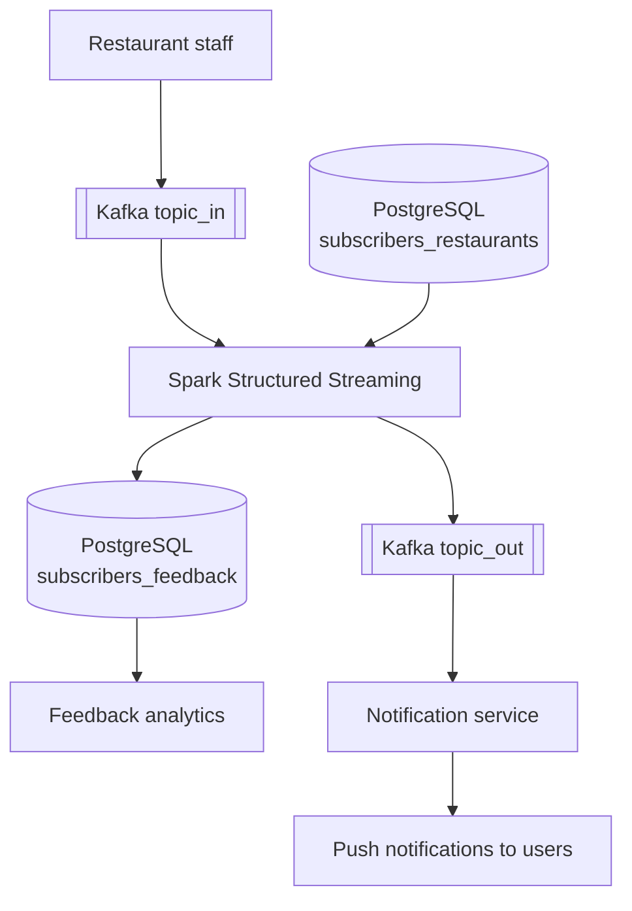

# Sprint 8 Project: Restaurant Subscription Streaming Service

A streaming service that processes restaurant subscriptions for a food-delivery aggregator.

## Description

The service processes restaurant promotional campaigns in real time and delivers personalised push notifications to the subscribers.

### Architecture



**Spark Streaming job steps:** parse JSON → filter by time window → join with subscribers → add `trigger_datetime` → persist DataFrame → write to PostgreSQL → serialize as JSON → push to Kafka → unpersist.

## Project Layout

```
sprint-8-streaming-notifications/
├── README.md
├── .gitignore
└── src/
    ├── scripts/
    │   ├── streaming.py      # Main Spark Streaming script
    │   ├── env.sh            # Configuration (not in git)
    │   ├── env.sh.example    # Example configuration
    │   ├── deploy.sh         # Deployment script
    │   ├── run_spark.sh      # Spark job launcher
    │   ├── kafka_producer.sh # Sends test messages
    │   └── kafka_consumer.sh # Reads messages from Kafka
    └── sql/
        └── ddl.sql           # DDL scripts for the tables
```

## Data Flows

### Input (Kafka `topic_in`)

JSON messages describing promotional campaigns:

```json
{
  "restaurant_id": "123e4567-e89b-12d3-a456-426614174000",
  "adv_campaign_id": "campaign-001",
  "adv_campaign_content": "20% off on all dishes!",
  "adv_campaign_owner": "Ivan Ivanov",
  "adv_campaign_owner_contact": "ivanov@restaurant.ru",
  "adv_campaign_datetime_start": 1768170000,
  "adv_campaign_datetime_end": 1768270000,
  "datetime_created": 1768170000
}
```

### Outputs

#### PostgreSQL (`subscribers_feedback`)

Records include a `feedback` column that is filled in later once the customer responds:

| Field | Type | Description |
|-------|------|-------------|
| restaurant_id | text | Restaurant ID |
| adv_campaign_id | text | Campaign ID |
| adv_campaign_content | text | Campaign content |
| adv_campaign_owner | text | Campaign owner |
| adv_campaign_owner_contact | text | Owner contact |
| adv_campaign_datetime_start | int8 | Campaign start (Unix timestamp) |
| adv_campaign_datetime_end | int8 | Campaign end (Unix timestamp) |
| datetime_created | int8 | Creation time (Unix timestamp) |
| client_id | text | Subscriber client ID |
| trigger_datetime_created | int4 | Processing time (Unix timestamp) |
| feedback | varchar | Client feedback (initially NULL) |

#### Kafka (`topic_out`)

JSON payload **without** the `feedback` field, meant for push notifications:

```json
{
  "restaurant_id": "123e4567-e89b-12d3-a456-426614174000",
  "adv_campaign_id": "campaign-001",
  "adv_campaign_content": "20% off on all dishes!",
  "adv_campaign_owner": "Ivan Ivanov",
  "adv_campaign_owner_contact": "ivanov@restaurant.ru",
  "adv_campaign_datetime_start": 1768170000,
  "adv_campaign_datetime_end": 1768270000,
  "datetime_created": 1768170000,
  "client_id": "223e4567-e89b-12d3-a456-426614174000",
  "trigger_datetime_created": 1768170500
}
```

## Configuration

Create `src/scripts/env.sh` from `env.sh.example`:

```bash
# Kafka
export KAFKA_BOOTSTRAP_SERVER="your-kafka-server:9091"
export KAFKA_USERNAME="your-username"
export KAFKA_PASSWORD="your-password"
export KAFKA_TOPIC_IN="your_topic_in"
export KAFKA_TOPIC_OUT="your_topic_out"

# PostgreSQL source (subscribers)
export PG_SOURCE_HOST="your-pg-source-host"
export PG_SOURCE_PORT="6432"
export PG_SOURCE_DB="de"
export PG_SOURCE_USER="your-user"
export PG_SOURCE_PASSWORD="your-password"

# PostgreSQL destination (feedback)
export PG_DEST_HOST="localhost"
export PG_DEST_PORT="5432"
export PG_DEST_DB="de"
export PG_DEST_USER="your-user"
export PG_DEST_PASSWORD="your-password"

# Remote server
export REMOTE_HOST="your-server-ip"
export REMOTE_USER="cluster-user"
export SSH_KEY="$HOME/.ssh/your_key"
export DOCKER_CONTAINER="your-container-name"
```

## Deployment and Run

### 1. Deploy code to the server

```bash
cd src/scripts
./deploy.sh
```

### 2. Start Spark Streaming

```bash
./run_spark.sh
```

### 3. Testing

Send a test message:
```bash
./kafka_producer.sh '{"restaurant_id":"123e4567-e89b-12d3-a456-426614174000",...}'
```

Read messages from Kafka:
```bash
./kafka_consumer.sh          # Input topic
./kafka_consumer.sh --out    # Output topic
```

## Technology

- **Apache Spark 3.3.0** — Structured Streaming.
- **Apache Kafka** — message broker with SASL_SSL (SCRAM-SHA-512).
- **PostgreSQL** — storage for subscribers and feedback.
- **Python 3.x** — PySpark.

## Implemented Steps

1. ✅ Read data from Kafka with SASL_SSL authentication.
2. ✅ Parse JSON into a typed DataFrame.
3. ✅ Filter by the active campaign time window.
4. ✅ Read subscriber data from PostgreSQL.
5. ✅ Join streaming and static data on `restaurant_id`.
6. ✅ Write to PostgreSQL (with the `feedback` column) via `foreachBatch`.
7. ✅ Send to Kafka (without `feedback`) in JSON.
8. ✅ DataFrame persistence (`persist` / `unpersist`).

## Mapping to the Architecture Diagram

| Architecture block | Implementation |
|-------------------|---------------|
| Kafka → JSON DataFrame | `from_json()` |
| Time filter | `filter()` on `adv_campaign_datetime_start/_end` |
| Read subscribers | `spark.read.jdbc()` + `cache()` |
| Join stream and static | `join()` on `restaurant_id` |
| `trigger_datetime_created` | `unix_timestamp(current_timestamp()).cast(IntegerType())` |
| Persist DataFrame | `df.persist()` inside `foreachBatch` |
| PostgreSQL write (with feedback) | `df.write.jdbc()` inside `foreach_batch_function` |
| JSON → Kafka (without feedback) | `to_json(struct(col("*"))) + write.kafka` |
| Unpersist | `df.unpersist()` |

## Code-Review Follow-ups

### 1. SSL certificates for Kafka in Spark

**Problem:** the Kafka SASL_SSL truststore was configured for `kafkacat` only and missing for the Spark Java client.

**Fix:** added Java truststore support via environment variables:
```python
KAFKA_SSL_TRUSTSTORE_LOCATION = os.getenv("KAFKA_SSL_TRUSTSTORE_LOCATION", "")
KAFKA_SSL_TRUSTSTORE_PASSWORD = os.getenv("KAFKA_SSL_TRUSTSTORE_PASSWORD", "")
```
`get_kafka_options()` inserts the truststore into the Kafka options when the variables are set.

### 2. Duplicate messages after restart (`checkpointLocation`)

**Problem:** missing `checkpointLocation` caused every restart to re-read the whole topic.

**Fix:** added a persistent checkpoint directory:
```python
CHECKPOINT_LOCATION = os.getenv(
    "CHECKPOINT_LOCATION",
    "/home/ajdaralijev/spark-checkpoints/restaurant-streaming",
)

query = result_df.writeStream \
    .option("checkpointLocation", CHECKPOINT_LOCATION) \
    .start()
```

### 3. Type mismatch for `trigger_datetime_created`

**Problem:** `unix_timestamp()` returns `LongType`, while PostgreSQL expects `int4`.

**Fix:** explicit cast to `IntegerType`:
```python
unix_timestamp(current_timestamp()).cast(IntegerType()).alias("trigger_datetime_created")
```

### 4. `foreachBatch` idempotency

**Problem:** a failure between the PostgreSQL write and the Kafka write caused duplicates after retry.

**Fix:** added a unique index in the DDL to reject duplicates:
```sql
CREATE UNIQUE INDEX idx_feedback_unique
    ON public.subscribers_feedback(restaurant_id, adv_campaign_id, client_id, datetime_created);
```

The protection is now two-layered:
- **`checkpointLocation`** prevents reprocessing on normal restarts.
- **Unique index** rejects duplicates on failure retries.

### 5. Performance (`show` / `count`)

**Problem:** `show()` and `count()` added unnecessary load.

**Fix:**
- Removed every call to `show()` and `count()`.
- Empty-batch detection uses `df.rdd.isEmpty()`.
- Added `cache()` to the subscribers table.
- Uses `persist()` / `unpersist()` inside `foreachBatch`.

### Test results

| Check | Result |
|-------|--------|
| Kafka SASL_SSL connectivity | ✅ |
| Reading subscribers from PostgreSQL | ✅ |
| Writing to PostgreSQL (`int4`) | ✅ |
| Sending to Kafka (without `feedback`) | ✅ |
| Checkpoint persistence | ✅ |
| Duplicate rejection | ✅ |
