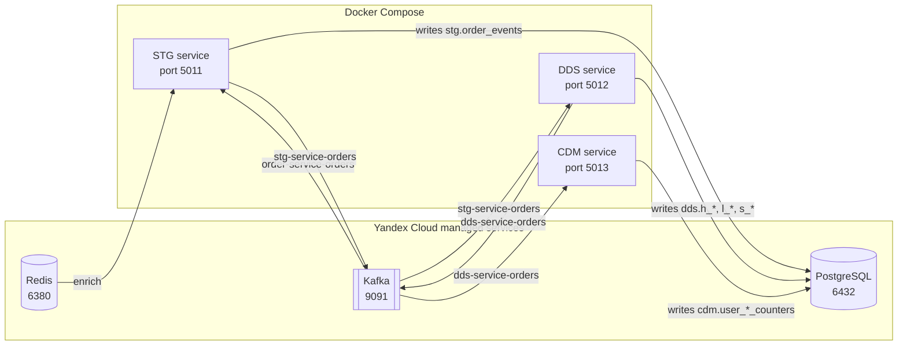
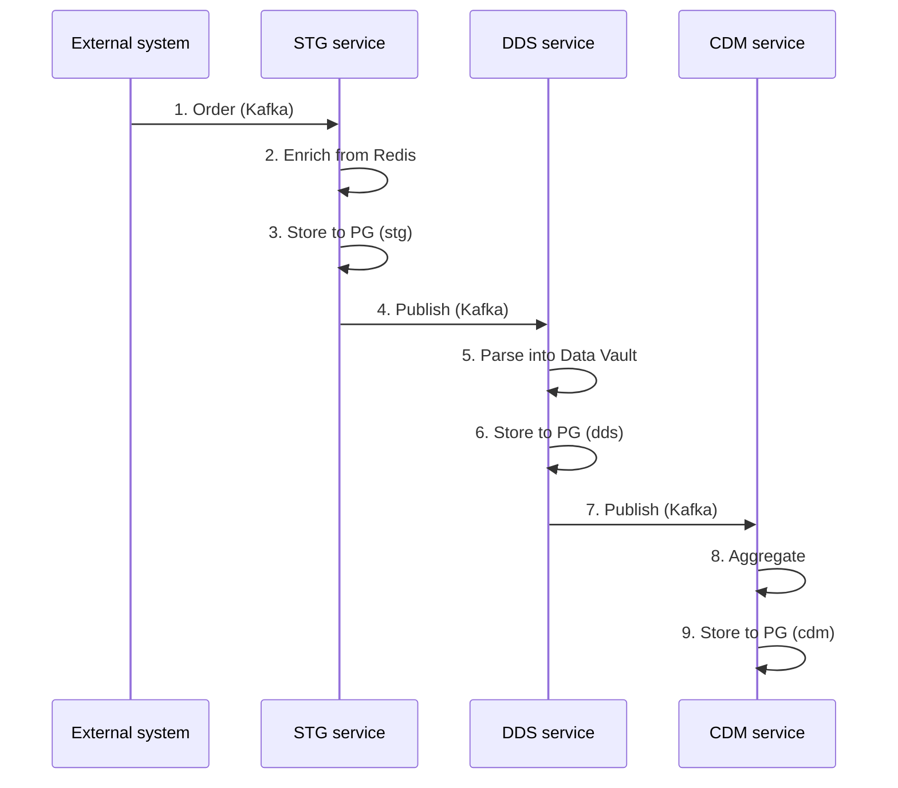
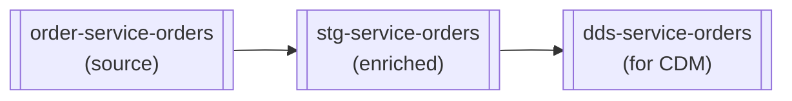

# Sprint 9 Project: Guest Tagging DWH Pipeline

A three-layer Data Warehouse that powers a guest tagging feature for a restaurant chain. Order data is ingested in real time through Kafka and persisted to PostgreSQL.

## Deployment Status

**Kubernetes (Yandex Cloud):**
- STG service: `cr.yandex/crp5jrq3v9u1b9npu54p/stg-service:2026.01.17` ✅ running
- DDS service: `cr.yandex/crp5jrq3v9u1b9npu54p/dds-service:2026.01.17` ✅ running
- CDM service: `cr.yandex/crp5jrq3v9u1b9npu54p/cdm-service:2026.01.17` ✅ running

**Check:**
```bash
kubectl get pods
kubectl get deployments
```

## Architecture

### Overall Diagram



Each service is a Flask app with a `/health` endpoint, an APScheduler tick every 25s, a Kafka consumer, and (except CDM) a Kafka producer. Message processors fan out through a repository layer onto PostgreSQL.

### Data Flow



### Kafka Topics



| Topic | Consumed by | Producer writes to |
|-------|-------------|--------------------|
| `order-service-orders` | STG | PG + `stg-service-orders` |
| `stg-service-orders`   | DDS | PG + `dds-service-orders` |
| `dds-service-orders`   | CDM | PG |

## Data Layers

### STG (Staging)

Raw order data from the source, enriched with user and restaurant data from Redis.

**Tables:**
- `stg.order_events` — raw JSON order events.

**Source:** Kafka topic `order-service-orders`.

**Sink:** Kafka topic `stg-service-orders`.

### DDS (Detailed Data Store)

Normalized storage following the Data Vault 2.0 model.

**Hubs (business keys):**
- `dds.h_user` — users.
- `dds.h_product` — products.
- `dds.h_category` — dish categories.
- `dds.h_restaurant` — restaurants.
- `dds.h_order` — orders.

**Links (relationships):**
- `dds.l_order_user` — order ↔ user.
- `dds.l_order_product` — order ↔ product.
- `dds.l_product_restaurant` — product ↔ restaurant.
- `dds.l_product_category` — product ↔ category.

**Satellites (attributes):**
- `dds.s_user_names` — user name.
- `dds.s_product_names` — product name.
- `dds.s_restaurant_names` — restaurant name.
- `dds.s_order_cost` — order cost.
- `dds.s_order_status` — order status.

**Source:** Kafka topic `stg-service-orders`.

**Sink:** Kafka topic `dds-service-orders`.

### CDM (Common Data Marts)

Marts that support guest-tagging analytics.

**Tables:**
- `cdm.user_product_counters` — per-user counters of orders by product.
- `cdm.user_category_counters` — per-user counters of orders by category.

**Source:** Kafka topic `dds-service-orders`.

## Project Layout

```
solution/
├── docker-compose.yaml          # Orchestrates the three containers
├── .env                         # Environment variables
├── README.md                    # Documentation
│
├── service_stg/                 # ══════ STG service ══════
│   ├── dockerfile               # Python 3.10 + dependencies
│   ├── requirements.txt         # flask, confluent-kafka, psycopg, redis, pydantic
│   └── src/
│       ├── app.py               # Flask + APScheduler (entry point)
│       ├── app_config.py        # Configuration from env variables
│       ├── lib/
│       │   ├── kafka_connect/   # KafkaConsumer, KafkaProducer
│       │   ├── pg/              # PgConnect (PostgreSQL)
│       │   └── redis/           # RedisClient
│       └── stg_loader/
│           ├── stg_message_processor_job.py   # Processing logic
│           └── repository/
│               └── stg_repository.py          # Database writes
│
├── service_dds/                 # ══════ DDS service ══════
│   ├── dockerfile
│   ├── requirements.txt         # flask, confluent-kafka, psycopg, pydantic
│   └── src/
│       ├── app.py               # Flask + APScheduler (entry point)
│       ├── app_config.py        # Configuration from env variables
│       ├── lib/
│       │   ├── kafka_connect/   # KafkaConsumer, KafkaProducer
│       │   └── pg/              # PgConnect (PostgreSQL)
│       └── dds_loader/
│           ├── dds_message_processor_job.py   # Processing logic
│           └── repository/
│               └── dds_repository.py          # Data Vault operations
│
└── service_cdm/                 # ══════ CDM service ══════
    ├── dockerfile
    ├── requirements.txt         # flask, confluent-kafka, psycopg, pydantic
    └── src/
        ├── app.py               # Flask + APScheduler (entry point)
        ├── app_config.py        # Configuration from env variables
        ├── lib/
        │   ├── kafka_connect/   # KafkaConsumer
        │   └── pg/              # PgConnect (PostgreSQL)
        └── cdm_loader/
            ├── cdm_message_processor_job.py   # Processing logic
            └── repository/
                └── cdm_repository.py          # Counter upserts
```

## How Each Service Works

All three services share the same skeleton:

```python
# app.py (entry point)
from flask import Flask
from apscheduler.schedulers.background import BackgroundScheduler

app = Flask(__name__)

@app.get('/health')
def health():
    return 'healthy'

if __name__ == '__main__':
    # 1. Build dependencies
    consumer   = config.kafka_consumer()
    producer   = config.kafka_producer()  # STG and DDS only
    repository = Repository(config.pg_warehouse_db())

    # 2. Build the processor
    processor = MessageProcessor(consumer, producer, repository, logger)

    # 3. Run a background job every 25 seconds
    scheduler = BackgroundScheduler()
    scheduler.add_job(func=processor.run, trigger="interval", seconds=25)
    scheduler.start()

    # 4. Start Flask (for the health endpoint)
    app.run(host='0.0.0.0', port=5000)
```

## Technology

- **Python 3.10** — language.
- **Flask** — HTTP server for health checks.
- **APScheduler** — background scheduler (every 25 s).
- **confluent-kafka** — Kafka client with SASL/SSL.
- **psycopg** — PostgreSQL driver.
- **pydantic** — data validation.
- **Redis** — cache of user and restaurant data (STG only).
- **Docker** — containerisation.

## Failure and Duplicate Protection

The pipeline offers **at-least-once** delivery with idempotent processing at every layer.

### Kafka offset commit

Each service commits the offset manually after a message has been processed successfully:

```python
# After a successful message
self._consumer.commit()
```

Consumer configuration:
```python
'enable.auto.commit': False,   # Auto-commit is OFF
'auto.offset.reset': 'earliest' # On first start, read from the beginning
```

**Guarantee:** if a service crashes, unprocessed messages are read again.

### STG — idempotency

`stg.order_events` uses a unique key on `object_id`:

```sql
INSERT INTO stg.order_events (...)
ON CONFLICT (object_id) DO NOTHING
```

**Guarantee:** inserting the same order twice is a no-op.

### DDS — idempotency (Data Vault)

All Data Vault tables use deterministic UUID keys and `ON CONFLICT DO NOTHING`:

```python
# Key generation from a business identifier
h_user_pk = generate_uuid(user_id)  # MD5 hash -> UUID
```

```sql
-- Hubs
INSERT INTO dds.h_user  (h_user_pk, ...)  ON CONFLICT (h_user_pk)  DO NOTHING
INSERT INTO dds.h_order (h_order_pk, ...) ON CONFLICT (h_order_pk) DO NOTHING

-- Links
INSERT INTO dds.l_order_user (hk_order_user_pk, ...)
  ON CONFLICT (hk_order_user_pk) DO NOTHING

-- Satellites
INSERT INTO dds.s_user_names (...)
  ON CONFLICT (h_user_pk, load_dt) DO NOTHING
```

**Guarantee:** re-processing the same order creates no duplicates in DDS.

### CDM — idempotency (counters)

CDM uses a utility table to track already-processed orders:

```sql
CREATE TABLE cdm.srv_processed_orders (
    order_id       INT PRIMARY KEY,
    processed_dttm TIMESTAMP NOT NULL DEFAULT NOW()
)
```

Processing flow:

```python
# 1. Was this order already processed?
if self._cdm_repository.is_order_processed(order_id):
    self._logger.info(f"Order {order_id} already processed, skipping")
    self._consumer.commit()
    continue

# 2. Update the counters
self._cdm_repository.user_product_counters_upsert(...)
self._cdm_repository.user_category_counters_upsert(...)

# 3. Mark the order as processed
self._cdm_repository.mark_order_processed(order_id)

# 4. Commit the offset
self._consumer.commit()
```

**Guarantee:** re-processing an order will not increment the counters twice.

### Protection summary

```
+------------------+------------------------+--------------------------------+
| Layer            | Protection mechanism   | What it protects               |
+------------------+------------------------+--------------------------------+
| Kafka            | Manual commit after    | No message loss when a service |
|                  | successful processing  | crashes                        |
+------------------+------------------------+--------------------------------+
| STG              | ON CONFLICT DO NOTHING | Duplicate order events         |
|                  | on object_id           |                                |
+------------------+------------------------+--------------------------------+
| DDS (hubs)       | ON CONFLICT DO NOTHING | Duplicate business entities    |
|                  | on h_*_pk (UUID)       | (users, products, orders…)     |
+------------------+------------------------+--------------------------------+
| DDS (links)      | ON CONFLICT DO NOTHING | Duplicate entity relationships |
|                  | on hk_*_pk (UUID)      |                                |
+------------------+------------------------+--------------------------------+
| DDS (satellites) | ON CONFLICT DO NOTHING | Duplicate attributes at the    |
|                  | on (h_*_pk, load_dt)   | same load time                 |
+------------------+------------------------+--------------------------------+
| CDM              | srv_processed_orders   | Double-counting on retry       |
|                  | table                  |                                |
+------------------+------------------------+--------------------------------+
```

### Crash recovery scenario

```
1. A service crashes while processing message #123.
2. The offset for #123 has NOT been committed yet.
3. The service restarts.
4. The consumer re-reads message #123.
5. Processing is idempotent:
   - STG: INSERT ... ON CONFLICT DO NOTHING (skip).
   - DDS: INSERT ... ON CONFLICT DO NOTHING (skip).
   - CDM: is_order_processed(123) = True (skip).
6. The offset is committed.
7. Processing continues with message #124.
```

## Run

### Prerequisites

1. Docker and Docker Compose.
2. Access to the Kafka cluster (Yandex Cloud).
3. Access to PostgreSQL (Yandex Cloud).
4. Access to Redis (Yandex Cloud).

### Configuration

Create `.env` in the project root:

```env
# Kafka settings
KAFKA_HOST=<kafka-host>
KAFKA_PORT=9091
KAFKA_CONSUMER_USERNAME=<username>
KAFKA_CONSUMER_PASSWORD=<password>

# Consumer groups
KAFKA_STG_CONSUMER_GROUP=stg-service-group
KAFKA_DDS_CONSUMER_GROUP=dds-service-group
KAFKA_CDM_CONSUMER_GROUP=cdm-service-group

# Kafka topics
KAFKA_ORDER_SERVICE_TOPIC=order-service-orders
KAFKA_STG_SERVICE_ORDERS_TOPIC=stg-service-orders
KAFKA_DDS_SERVICE_ORDERS_TOPIC=dds-service-orders

# Redis (STG only)
REDIS_HOST=<redis-host>
REDIS_PORT=6380
REDIS_PASSWORD=<password>

# PostgreSQL
PG_WAREHOUSE_HOST=<pg-host>
PG_WAREHOUSE_PORT=6432
PG_WAREHOUSE_DBNAME=<dbname>
PG_WAREHOUSE_USER=<username>
PG_WAREHOUSE_PASSWORD=<password>
```

### Build and run

```bash
# Build and start everything
docker-compose up -d --build

# Check status
docker ps

# Tail logs
docker logs stg_service_container
docker logs dds_service_container
docker logs cdm_service_container
```

### Health checks

```bash
curl http://localhost:5011/health  # STG
curl http://localhost:5012/health  # DDS
curl http://localhost:5013/health  # CDM
```

## Message Formats

### Input message (`order-service-orders`)

```json
{
  "object_id": 9242179,
  "object_type": "order",
  "payload": {
    "id": 9242179,
    "date": "2026-01-08 18:56:09",
    "cost": 3660,
    "payment": 3660,
    "status": "CLOSED",
    "restaurant": { "id": "ef8c42c1..." },
    "user":       { "id": "626a81ce..." },
    "products":   [ ... ]
  }
}
```

### STG → DDS (`stg-service-orders`)

```json
{
  "object_id": 9242179,
  "object_type": "order",
  "payload": {
    "id": 9242179,
    "date": "2026-01-08 18:56:09",
    "cost": 3660,
    "payment": 3660,
    "status": "CLOSED",
    "restaurant": {
      "id": "ef8c42c1...",
      "name": "Pizza House"
    },
    "user": {
      "id": "626a81ce...",
      "name": "Ivan Petrov"
    },
    "products": [
      {
        "id": "47b94729...",
        "name": "Butter Naan",
        "price": 120,
        "quantity": 8,
        "category": "Bread"
      }
    ]
  }
}
```

### DDS → CDM (`dds-service-orders`)

```json
{
  "object_id": 9242179,
  "object_type": "order",
  "payload": {
    "user_id": "626a81ce...",
    "products": [
      {
        "id": "47b94729...",
        "name": "Butter Naan",
        "category": "Bread"
      }
    ]
  }
}
```

## UUID Key Generation

Deterministic UUIDs from business keys are built from MD5 hashes:

```python
import hashlib
import uuid

def generate_uuid(value: str) -> uuid.UUID:
    return uuid.UUID(hashlib.md5(value.encode()).hexdigest())

# Examples
h_user_pk       = generate_uuid(user_id)           # User UUID
h_order_pk      = generate_uuid(str(order_id))     # Order UUID
hk_order_user_pk = generate_uuid(f"{order_id}_{user_id}")  # Link UUID
```

## Data Checks

```sql
-- STG
SELECT COUNT(*) FROM stg.order_events;

-- DDS hubs
SELECT COUNT(*) FROM dds.h_order;
SELECT COUNT(*) FROM dds.h_user;
SELECT COUNT(*) FROM dds.h_product;

-- CDM marts
SELECT * FROM cdm.user_product_counters  ORDER BY order_cnt DESC LIMIT 10;
SELECT * FROM cdm.user_category_counters ORDER BY order_cnt DESC LIMIT 10;
```

## Stop the services (Docker Compose)

```bash
docker-compose down
```

## Kubernetes Deployment (Yandex Cloud + Helm)

### Container Registry

The service images live in Yandex Container Registry:

- **STG service:** `cr.yandex/crp5jrq3v9u1b9npu54p/stg-service:2026.01.17`
- **DDS service:** `cr.yandex/crp5jrq3v9u1b9npu54p/dds-service:2026.01.17`
- **CDM service:** `cr.yandex/crp5jrq3v9u1b9npu54p/cdm-service:2026.01.17`

### Build and publish

```bash
# 1. Authenticate with Yandex Container Registry
yc container registry configure-docker

# 2. Build and push the STG service
cd solution/service_stg
docker build -t cr.yandex/crp5jrq3v9u1b9npu54p/stg-service:2026.01.17 .
docker push    cr.yandex/crp5jrq3v9u1b9npu54p/stg-service:2026.01.17

# 3. Build and push the DDS service
cd ../service_dds
docker build -t cr.yandex/crp5jrq3v9u1b9npu54p/dds-service:2026.01.17 .
docker push    cr.yandex/crp5jrq3v9u1b9npu54p/dds-service:2026.01.17

# 4. Build and push the CDM service
cd ../service_cdm
docker build -t cr.yandex/crp5jrq3v9u1b9npu54p/cdm-service:2026.01.17 .
docker push    cr.yandex/crp5jrq3v9u1b9npu54p/cdm-service:2026.01.17
```

### Kubernetes secrets

```bash
# STG secrets (includes Redis)
kubectl create secret generic stg-service-secrets \
  --from-literal=KAFKA_HOST=<kafka-host> \
  --from-literal=KAFKA_CONSUMER_USERNAME=<username> \
  --from-literal=KAFKA_CONSUMER_PASSWORD=<password> \
  --from-literal=REDIS_HOST=<redis-host> \
  --from-literal=REDIS_PASSWORD=<redis-password> \
  --from-literal=PG_WAREHOUSE_HOST=<pg-host> \
  --from-literal=PG_WAREHOUSE_DBNAME=<dbname> \
  --from-literal=PG_WAREHOUSE_USER=<pg-user> \
  --from-literal=PG_WAREHOUSE_PASSWORD=<pg-password>

# DDS secrets
kubectl create secret generic dds-service-secrets \
  --from-literal=KAFKA_HOST=<kafka-host> \
  --from-literal=KAFKA_CONSUMER_USERNAME=<username> \
  --from-literal=KAFKA_CONSUMER_PASSWORD=<password> \
  --from-literal=PG_WAREHOUSE_HOST=<pg-host> \
  --from-literal=PG_WAREHOUSE_DBNAME=<dbname> \
  --from-literal=PG_WAREHOUSE_USER=<pg-user> \
  --from-literal=PG_WAREHOUSE_PASSWORD=<pg-password>

# CDM secrets
kubectl create secret generic cdm-service-secrets \
  --from-literal=KAFKA_HOST=<kafka-host> \
  --from-literal=KAFKA_CONSUMER_USERNAME=<username> \
  --from-literal=KAFKA_CONSUMER_PASSWORD=<password> \
  --from-literal=PG_WAREHOUSE_HOST=<pg-host> \
  --from-literal=PG_WAREHOUSE_DBNAME=<dbname> \
  --from-literal=PG_WAREHOUSE_USER=<pg-user> \
  --from-literal=PG_WAREHOUSE_PASSWORD=<pg-password>
```

### Deploy with Helm

```bash
# Deploy every service
helm upgrade --install stg-service solution/service_stg/helm/stg-service
helm upgrade --install dds-service solution/service_dds/helm/dds-service
helm upgrade --install cdm-service solution/service_cdm/helm/cdm-service

# Or pin the tag explicitly
helm upgrade --install stg-service solution/service_stg/helm/stg-service --set image.tag=2026.01.17
helm upgrade --install dds-service solution/service_dds/helm/dds-service --set image.tag=2026.01.17
helm upgrade --install cdm-service solution/service_cdm/helm/cdm-service --set image.tag=2026.01.17
```

### Upgrade releases

```bash
helm upgrade stg-service solution/service_stg/helm/stg-service
helm upgrade dds-service solution/service_dds/helm/dds-service
helm upgrade cdm-service solution/service_cdm/helm/cdm-service
```

### Status checks

```bash
# Helm releases
helm list

# Pods
kubectl get pods -l app=stg-service
kubectl get pods -l app=dds-service
kubectl get pods -l app=cdm-service

# Logs
kubectl logs -l app=stg-service --tail=50
kubectl logs -l app=dds-service --tail=50
kubectl logs -l app=cdm-service --tail=50

# Deployments
kubectl get deployment stg-service
kubectl get deployment dds-service
kubectl get deployment cdm-service
```

### Remove releases

```bash
helm uninstall stg-service
helm uninstall dds-service
helm uninstall cdm-service
```

### Helm chart layout

```
solution/
├── service_stg/
│   └── helm/
│       └── stg-service/
│           ├── Chart.yaml           # Chart metadata
│           ├── values.yaml          # Default values
│           └── templates/
│               ├── deployment.yaml  # Deployment template
│               └── service.yaml     # Service template
├── service_dds/
│   └── helm/
│       └── dds-service/
│           ├── Chart.yaml
│           ├── values.yaml
│           └── templates/
│               ├── deployment.yaml
│               └── service.yaml
└── service_cdm/
    └── helm/
        └── cdm-service/
            ├── Chart.yaml
            ├── values.yaml
            └── templates/
                ├── deployment.yaml
                └── service.yaml
```

### `values.yaml` Configuration

Primary knobs:

- `replicaCount` — number of replicas (default 1).
- `image.repository` — Container Registry image path.
- `image.tag` — image tag.
- `resources.requests` / `resources.limits` — CPU and memory limits.
- `env.*` — non-secret environment variables.
- `secretName` — Kubernetes Secret name with credentials.

**Current resource limits** (tuned for the 1 CPU / 1 GiB memory / 3 pods quota):
```yaml
resources:
  requests:
    memory: "128Mi"
    cpu: "50m"
  limits:
    memory: "256Mi"
    cpu: "200m"
```

## Troubleshooting

### Kubernetes quota exceeded

If deployment fails with `exceeded quota`, lower the resource limits in `values.yaml`:
```bash
helm upgrade <service> <chart-path> \
  --set resources.limits.cpu=100m \
  --set resources.limits.memory=128Mi
```

### Topic not found (`Unknown topic or partition`)

The Kafka cluster may not support auto-creation of topics. Create them manually through the Kafka UI or `AdminClient`.

### No new messages

Check the consumer-group offset:
- If the offset sits at the tail, every message has been processed.
- To reprocess everything, switch `KAFKA_*_CONSUMER_GROUP` to a new value.

### PostgreSQL connection error

Make sure that:
1. The certificate `/crt/YandexInternalRootCA.crt` is available.
2. The IP address is whitelisted for the cluster.
3. Port 6432 (pgbouncer) is reachable.
